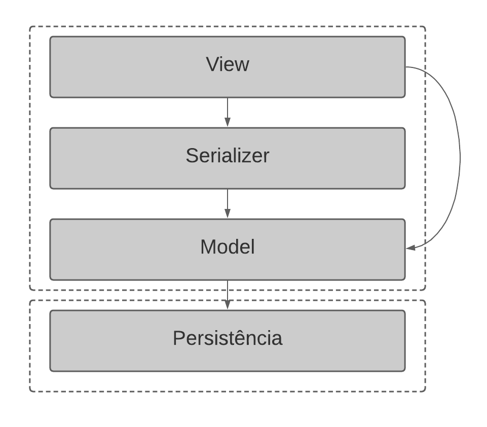
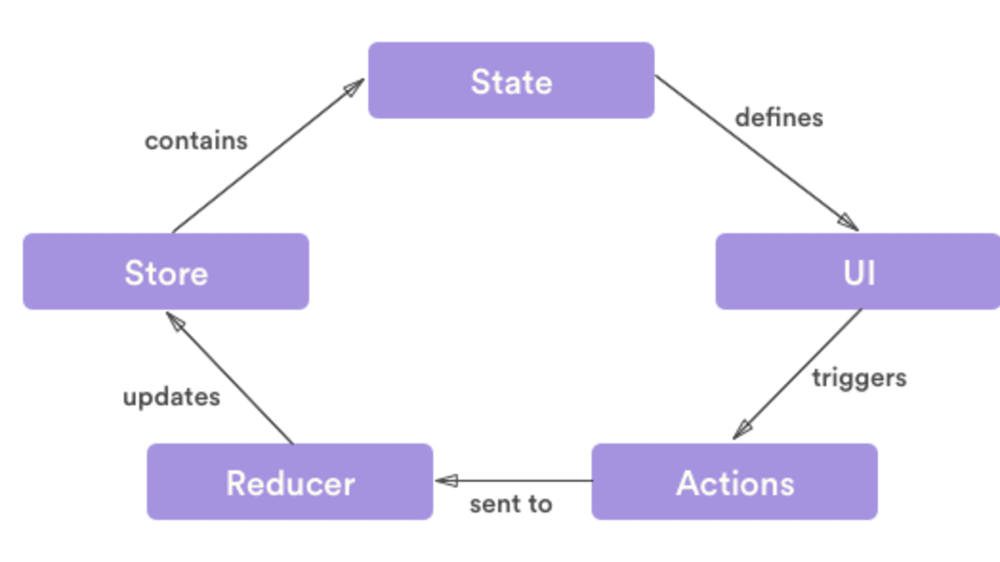
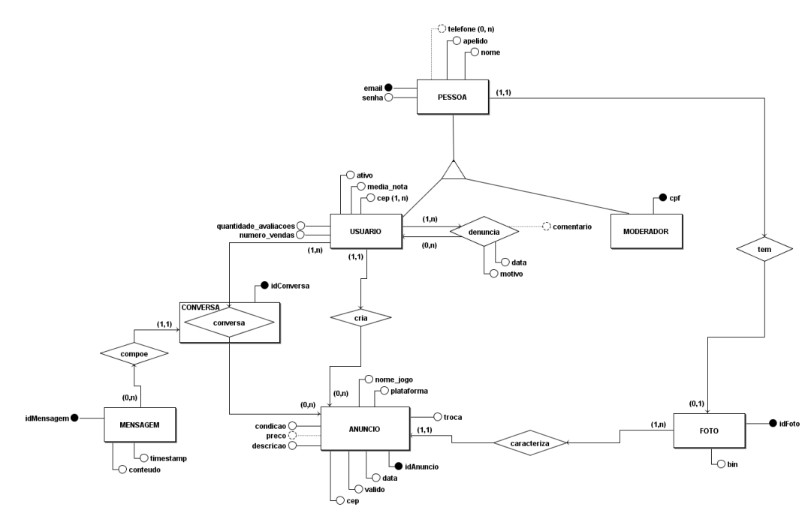
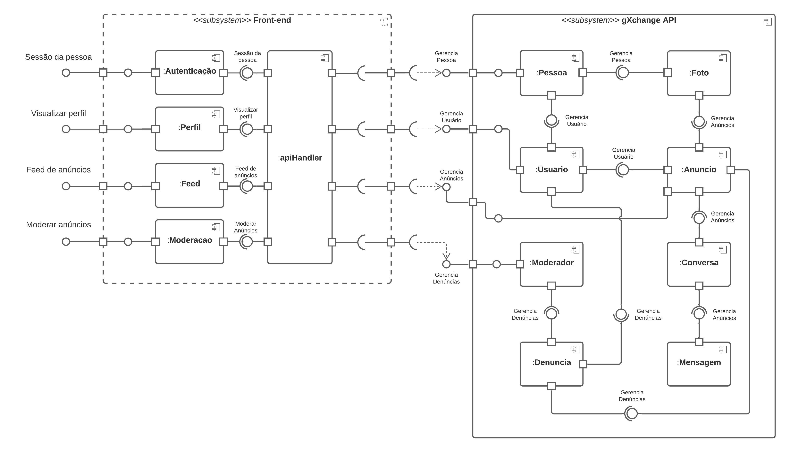
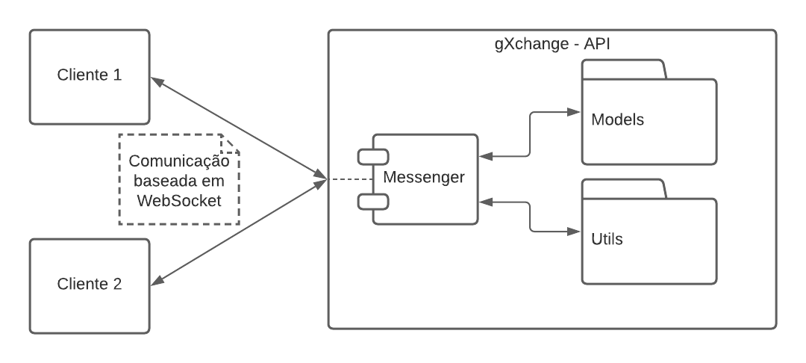
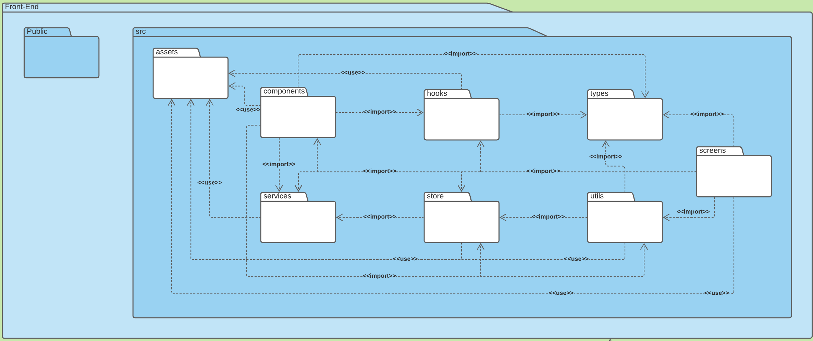
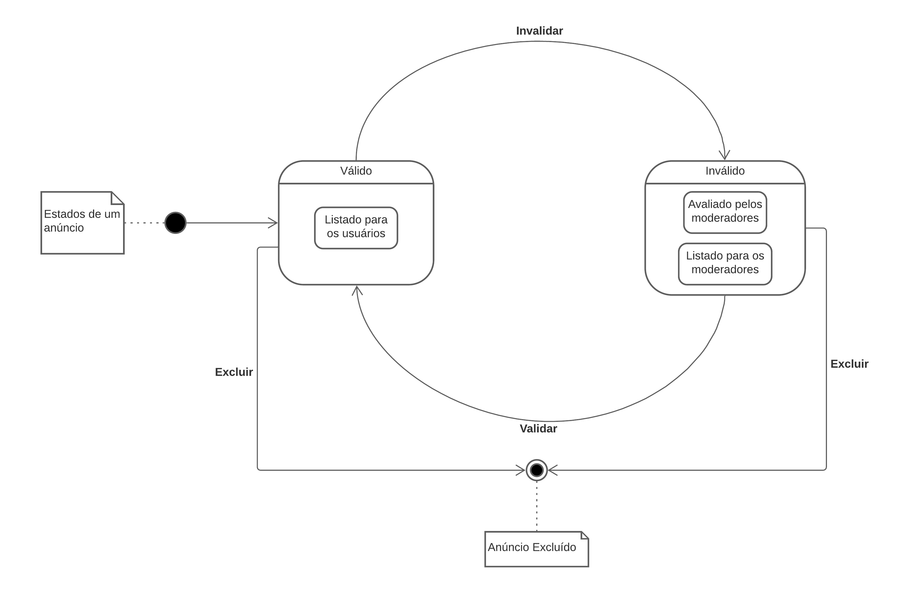
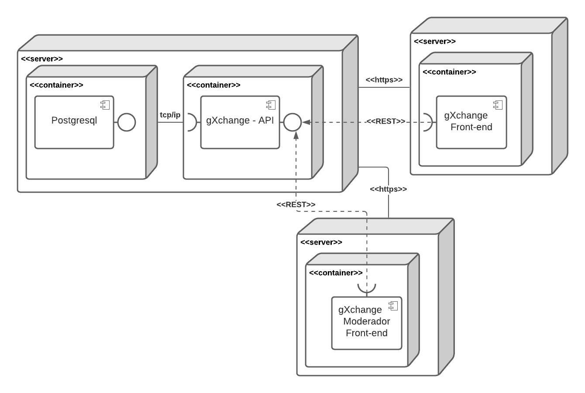
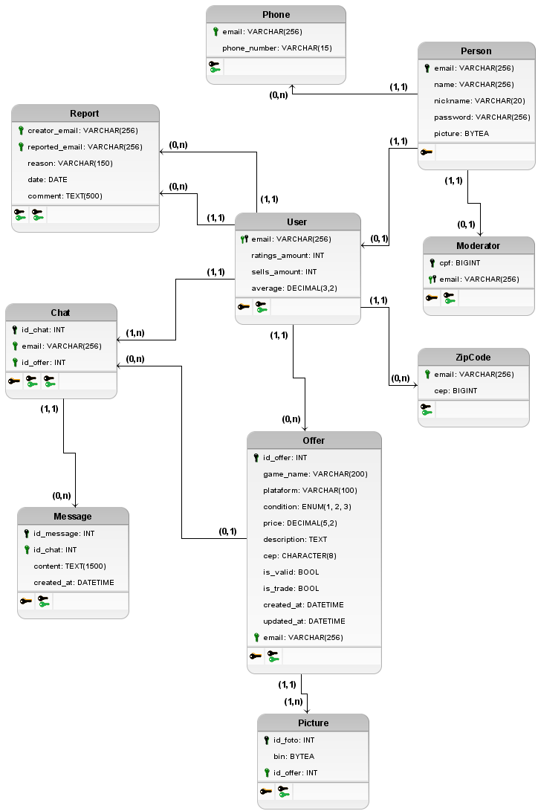

# Documento de Arquitetura de Software

## 1. Introdução

### 1.1 Propósito

Este documento fornece uma visão arquitetural abrangente do sistema, usando diversas visões de arquitetura para representar diferentes aspectos do sistema. Ele pretende capturar e transmitir as decisões arquiteturas significativas que foram tomadas em relação ao sistema.

### 1.2 Escopo

Este documento se aplica a arquitetura do <strong>gXchange</strong> e todos os seus componentes, módulos, sistemas e subsistemas, além dos repositórios de implementação.

### 1.3 Definições Acrônimos e Abreviações

| Acrônimo | Forma extendida       |
| -------- | --------------------- |
| DRF      | Django Rest-Framework |
| ORM      | Object Relational Mapper |
| URI      | Uniform Resource Identifier |
| HTTP | Hypertext Transfer Protocol |
| TCP | Transmission Control Protocol |

Os léxicos aplicáveis no contexto do gXchange podem ser consultados no documento de <a href="../../../desenho/base/1.1/lexico">léxicos</a>

Requisitos, histórias de usuário, épicos e features seguem o padrão já adotado no <a href="../../../desenho/modelagem/iniciativa/especificacao_suplementar">SRS</a> que referencia a seção de padrões da Wiki. Esses que serão referenciados pelo padrão identificador seguido pelo seu título.

### 1.4 Referências

> Documento de arquitetura de Software. UFPE. Disponível em: https://www.cin.ufpe.br/~gta/rup-vc/core.informal_resources/guidances/examples/resources/ex_sad.htm. Acesso em: 24/04/2021

> Documento de arquitetura de Software. UFPE. Disponível em: https://www.cin.ufpe.br/~gta/rup-vc/extend.formal_resources/guidances/examples/resources/sadoc_v1.htm. Acesso em: 24/04/2021

> Artefatos do gXchange. Disponível em: https://github.com/UnBArqDsw2020-2/2020.2_G7_gXchange_DOCS.

> Visões Arquiteturais. Disponível em: https://www.dimap.ufrn.br/~thais/Arquitetura20081/Visoes4+1eDocumentacao.pdf. Acesso em: 27/04/2021

> Kruchten’s 4 + 1 views of Software Design. Disponível em: https://medium.com/the-mighty-programmer/kruchtens-views-of-software-design-e9088398c592. Acesso em: 27/04/2021

### 1.5 Visão Geral

Este documento é divido em seções, cada qual com seu próposito:

| Tópico | Descrição |
| ------ | --------- |
| [Representação Arquitetural](#2-representacao-arquitetural) | Contém por meio de diagramas o padrão arquitetural do sistema |
| [Objetivos Arquiteturais e Restrições](#3-objetivos-arquiteturais-e-restricoes) | Descreve os requisitos do software e objetivos que impactam na arquitetura, além das restrições |
| [Visualização de Casos de Uso](#4-visualizacao-de-casos-de-uso) | Lista os casos de uso e cenários do software |
| [Visão Lógica](#5-visao-logica) | Descreve as partes importantes do domínio modelo, assim como sua decomposição em subsistemas, pacotes, classes e classes de utilidade |
| [Visão de Processo](#6-visao-de-processo) | Descreve a decomposição do sistema em processos |
| [Visão de Implantação](#7-visao-de-implantacao) | Descreve as configurações físicas em que o software roda e é implantado, assim como, o processo de implantação adotado |
| [Visão de Implementação](#8-visao-de-implementacao) | Descreve de forma geral a estrutura de implementação do software, a decomposição do software em camadas e subsistemas |
| [Visão de Dados](#9-visao-de-dados) | Descreve como a camada de persistência vai persistir os dados, e como os dados são modelados  |
| [Tamanho e Perfomance](#10-tamanho-e-performance) | Descreve o tamanho do software e seu impacto em relação a arquitetura, assim como os objetivos de performance |
| [Qualidade](#11-qualidade) | Descreve como a arquitetura impacta e contribuí para os atributos de qualidade |

## 2. Representação Arquitetural

A solução arquitetural definida para o gXchange pode ser visualizada, em sua forma com granularidade menor, abaixo:

<a href="https://drive.google.com/file/d/1raywRBZc67k7WeM89ZlA2T3kvpV1XzzX/view?usp=sharing" target="_blank" rel="noopener noreferrer">Link para a imagem</a>

Consiste numa arquitetura que obedece o modelo Cliente-Servidor, em que no caso os dois Clientes são os chamados Front-end. Já o servidor, é a gXchange-API, também chamada de Back-end;

### 2.1 Back-end

O Back-end adota o padrão MVC, no caso o MVT por fazer uso do framework Django, que se estrutura como um modelo N-Camadas. No caso há 4 camadas, sendo que há uma camada denominada <em><strong>Serializer</strong></em>. Como se pode ver é um modelo em sua forma relaxada, pois a camada <em><strong>View</strong></em> se comunica tanto com a camada <em><strong>Serializer</strong></em> e <em><strong>Model</strong></em>.

De modo análogo, os clientes podem ser considerados, semanticamente, a quinta camada dessa arquitetura, pois dependem e consomem diretamente da camada de <em><strong>View</strong></em>.

<a href="https://drive.google.com/file/d/17g7W3HaW2Xz1L-9bsFtMDRHLx4iUe8zx/view?usp=sharing" target="_blank" rel="noopener noreferrer">Link para a imagem</a>

### 2.2 Front-end

Os dois subsistemas de Front-end, poderão, eventualmente, fazer uso do padrão arquitetural do Redux:

"ABC of Redux", Radium Sharma. Disponível em: <a href="https://dev.to/radiumsharma06/abc-of-redux-5461" target="_blank" rel="noopener noreferrer">https://dev.to/radiumsharma06/abc-of-redux-5461</a>

<a href="https://drive.google.com/file/d/1vNW5YdqcI97oQLPFDMWcCx-zE9BRs_v5/view?usp=sharing" target="_blank" rel="noopener noreferrer">Link para a imagem</a>

## 3. Objetivos Arquiteturais e Restrições

No tocante às restrições, requisitos e objetivos da arquitetura do gXchange, serão listados abaixo os pontos mais importantes:

- A arquitetura condiz com as especificações do documento de [especificação suplementar](../../../desenho/modelagem/iniciativa/especificacao_suplementar)
- O sistema deve controlar o acesso a funcionalidades que demandem uma sessão de usuário, para seu uso é necessário que o usuário tenha logado.
- O sistema deve assegurar a proteção dos dados relacionados aos usuários cadastrados.
- As funcionalidades do sistema deverão estar disponíveis à clientes com conexão a internet.
- A camada de persistência não deve ser acessada por outro sistema.

## 4. Visualização de Casos de Uso

Os casos de uso da arquitetura podem ser descritos no diagrama de casos de uso abaixo:

<a href="https://drive.google.com/file/d/1bdUfvqetxqyKWymxkl93LRYlqxshNp2p/view?usp=sharing" target="_blank" rel="noopener noreferrer">Link para a imagem</a>

### 4.1 Descrições Significativas de Casos de Uso

#### 1 Obter anúncios

Este caso de uso ocorre quando o usuário acessa o Feed de anúncios. O cliente obterá os anúncios do Servidor.

#### 2 Criar anúncios

Este caso de uso ocorre quando o usuário cria um novo anúncio

#### 3 Apagar anúncios

Este caso de uso ocorre quando o usuário apaga um determinado anúncio, o anúncio deve pertencer a ele. No caso do moderador, pode ser qualquer anúncio do sistema. O cliente fica encarregado da obrigação de informar qual anúncio deverá ser apagado.

#### 4 Editar anúncios

Este caso de uso ocorre quando o usuário edita um determinado anúncio, o anúncio deve pertencer a ele. Cabe ao cliente enviar as informações que deverão ser alteradas para o servidor.

#### 5 Fazer login

Este caso de uso ocorre quando o usuário faz login no sistema. O Cliente então envia uma solicitação de login para o servidor, o servidor verifica a veracidade dos dados.

#### 6 Enviar mensagens

Este caso de uso ocorre quando o usuário envia mensagens para outros usuários por meio dos anúncios. No caso o Moderador pode conversar diretamente com os outros usuários. 

#### 7 Invalidar anúncios

Este caso de uso ocorre quando um Moderador decide que um dado anúncio não está seguindo as regras da comunidade gXchange. Cabe ao Cliente propagar as alterações, e, cabe ao servidor concluir a alteração e notificar o usuário envolvido.

## 5. Visão Lógica

### 5.1 Visão Geral

#### 5.1.1 Diagrama de Classe

##### 5.1.1.1 API Adapter

O seguinte diagrama de classes refere-se a API Adapter, que é uma classe que define a comunicação com a API e deve ser instanciada em cada componente que deseje utilizá-la. Sua importância reside na padronização e indireção de como a comunicação entre Cliente-Servidor ocorrem.

<a href="https://drive.google.com/file/d/12_oC8nNzs99IKkeRxOccGGSubi9BhVkm/view?usp=sharing" target="_blank" rel="noopener noreferrer">Link para a imagem</a>

#### 5.1.2 Diagrama Entidade Relacionamento

O seguinte diagrama entidade-relacionamento consiste na organização lógica das entidades do sistema.

<a href="https://drive.google.com/file/d/1Q6sb6HgKvMaeHeqgr9ZSxvIPH3Fdf6Xi/view?usp=sharing" target="_blank" rel="noopener noreferrer">Link para a imagem</a>

#### 5.1.3 Diagrama de Componentes

De modo a representar como os componentes são relacionados, e com quais eles se comunicam pode-se optar pelo seguinte diagrama de componentes:

<a href="https://drive.google.com/file/d/1damFiR7XnzrVgZ6FFMGTPE7N59LALkHD/view?usp=sharing" target="_blank" rel="noopener noreferrer">Link para a imagem</a>

O subsistema apresentado acima refere-se, de maneira genérica, aos componentes que poderão estar presentes nos dois clientes propostos, com exceção do componente referente às funções de moderador. Foi escolhida a notação de subsistema com as linhas pontilhadas para esta representação.

#### 5.1.4 Notificações

Alguns dos componentes podem requerir a utilização de um sistema de notificação, em que no caso simula a comunicação entre dois Clientes por meio do Servidor. Neste caso, será criado um componente com a responsabilidade de troca das mensagens.

<a href="https://drive.google.com/file/d/1Vc_DKUZQer32j1gRJXIJi3m_M-ec_2J6/view?usp=sharing" target="_blank" rel="noopener noreferrer">Link para a imagem</a>

No diagrama acima, pode-se observar um componente <strong><em>Messenger</em></strong>, que poderá ser utilizado por outras classes e que representa a comunicação baseada em WebSocket entre o Cliente e o Servidor. 

Por essa abordagem, o cliente se registra no EndPoint com a interface WebSocket, e pode assim ser notificado dos eventos/sinais que ocorrem ou são disparados no Servidor.  

### 5.2 Desenho de Pacotes Arquiteturalmente Significantes

#### 5.2.1 Cliente

Ambos os clientes respeitam a seguinte diagramação de pacotes:

<a href="https://drive.google.com/file/d/1PosBI3rpRBqdWrecoMd2muNM6-9-o4m4/view?usp=sharings" target="_blank" rel="noopener noreferrer">Link para a imagem</a>

#### public

Neste pacote estarão os arquivos estáticos que estão relacionados a estrutura da página em si.

#### assets

Neste pacote estarão os arquivos que são servidos estaticamente.

#### components

Neste pacote estarão os componentes globais que poderão ser utilizados por todos os outros componentes ou telas do projeto. Componentes podem ser aninhados com seus sub-componentes.

#### screen

Neste pacote, estarão os componentes que representam telas do subsistema, cada screen pode ser uma combinação de componentes e pode possuir seu próprio pacote de componentes.

#### services

Neste pacote estarão <em>services</em> que podem ser utilizados por todos os demais componentes (refere-se aos componentes no geral e não apenas os componentes React do front-end), como por exemplo a API Adapter. A diferença entre esse pacote e o de utils está na importância e complexidade das funcionalidades que ele provê, o pacote de <em>utils</em> fornece utilidades que não são críticas para o sistema.

#### hooks

Este pacote contém os <em>hooks</em> que são criados utilizando a <em>Context API</em> do React, que permitem que componentes que possuam o <em>provider</em> como componente pai utiliza os dados fornecidos por ele, permitindo um controle maior controle de acesso.

#### types

Neste pacote estarão as classes que podem representar o modelo de domínio, e assim facilitar a tipagem dessas interfaces nos subsistemas de front-end.

#### store

Define os objetos (definição geral de objeto) que compõem o estado global da aplicação, utilizando a biblioteca redux e react-redux.

#### utils

O pacote <em>utils</em> pode ser considerado um pacote que pode ser compartilhado entre os dois subsistemas do Front-End, ele fornece utilidades, funcionalidades que não são críticas para o funcionamento do sistema.

#### 5.2.1 Servidor

<a href="https://drive.google.com/file/d/1dMPd_sjlOXFsWWEbcgAz-kdwy_u8z6gT/view?usp=sharing" target="_blank" rel="noopener noreferrer">Link para a imagem</a>

#### api

Pacote principal, contém as configurações e as rotas associadas a Back-End API.

#### settings

Possui configurações gerais relevantes ao funcionamento da API, conexão com serviço de banco de dados, dependências e pacotes externos que serão utilizados.

#### urls

Tanto no pacote api e no pacote app, este pacote refere-se aos endereços, que utilizam o padrão <strong>URI</strong>

#### migrations

Neste pacote estão contidas as migrações geradas pelo mapeamento ORM, e deverão ser mantidas e compartilhadas, pois representam a evolução e alterações do modelo de domínio.

#### tests

Neste pacote estarão contidos os testes, sejam unitários ou outros tipos de teste, no contexto da aplicação.

## 6. Visão de Processo

### 6.1 Transições de estado

#### Anúncio

Refere-se aos estados que um dado anúncio pode transicionar ao longo da execução do software. Representado pelo seguinte diagrama:

<a href="https://drive.google.com/file/d/1LwM7ArpFO7gMIzwc-FQl7OL3FlMuQNpY/view?usp=sharing" target="_blank" rel="noopener noreferrer">Link para a imagem</a>

#### Conta

Refere-se aos estados que uma dada conta de usuário pode transicionar ao longo da execução do software. Representado pelo seguinte diagrama:

<a href="https://drive.google.com/file/d/1ymASm8SGyDbJvkVIgiXMNRS6dB91OjyW/view?usp=sharing" target="_blank" rel="noopener noreferrer">Link para a imagem</a>

### 6.2 Fluxo de dados

Os dados fluem bidirecionalmente entre as camadas do back-end, e também fluem de modo análogo quando se refere a comunicação Cliente-Servidor. Ou seja, os dados de um cliente não são repassados a outros clientes diretamente.

### 6.2 Fluxo de Atividades

Os fluxos de atividades referentes ao sistemas e subsistemas podem ser encontrados na seção de <a href="../../../desenho/modelagem/2.2/diagramas_atividades">diagramas de atividades</a>

## 7. Visão de Implantação

No contexto da implantação (<em>deploy</em>) do software, seguindo os princípios de devops, em que infraestrutura é escrita como código. Todo o processo de implantação deve ser de maneira automatizada ao longo dos repositórios do software. Os serviços deverão ser implantados utilizando Docker e Docker-compose.

De mesmo modo, os subsistemas podem ser implantados em servidores, torna-se então indiferente se serão dispostos em um mesmo servidor, ou em servidores diferentes.

Para escalar os serviços, aplica-se principalmente a Back-end - API, deverão ser implantados utilizando Docker Swarm mode, com replicação, ou seja replicando o serviço e também utilizando <em>Load Balancing</em>.

<a href="https://drive.google.com/file/d/1tobCBehmQmZ7f7O-NXoyvLoYRYQJrHLN/view?usp=sharing" target="_blank" rel="noopener noreferrer">Link para a imagem</a>

## 8. Visão de Implementação

### 8.1 Camadas

Além da divisão em subsistemas já propostas, e com ênfase na definição em camadas listada no tópico <a href="#21-back-end">2.1</a>, o desenvolvimento no subsistema gXchange-API deve seguir os padrões de código do framework Django e também do framework Django Rest (DRF). Isso implica diretamente em como as camadas são definidas, e quais as responsabilidades atribuídas a cada uma delas.

#### 8.1.1 View

Esta camada é a camada que ficará responsável por receber as requisições dos clientes, e reagirá baseada nos verbos HTTP (<em>GET, HEAD, POST, PUT, PATCH, DELETE, CONNECT, OPTIONS e TRACE</em>).

#### 8.1.2 Serializer

Esta camada tem a responsabilidade de processar os dados advindos da camada Model, e também é responsável por abstrair e implementar como serão feitas as alterações nas classes da camada Model. 

#### 8.1.3 Model

Esta camada carrega consigo o modelo de domínio, e por obedecer ao padrão <em>Active Record</em>, tem a capacidade de abstrair as tabelas da camada de persistência. Também tem a responsabilidade de abstrair os relacionamentos entre as mesmas.

#### 8.1.4 Persistência

Camada em que os dados serão guardados de maneira estruturada, utilizando o banco de dados Objeto-Relacional Postgresql.

### 8.2 Metodologia de Desenvolvimento

As metodologias adotadas serão Agile, Scrum e XP. Sendo que no mesmo contexto será utilizado o framework DevOps pela equipe de infraestrutura, mas que também se aplica à equipe de desenvolvimento.

### 8.3 Padrões de Desenvolvimento

A ferramenta utilizada para versionamento será o GitHub, não há padronização para Editor de Texto ou IDE, mas os repositórios de subsistemas deverão estar configurados com ferramentas de análise estática de código. Prevê assim uma melhor eficiência e padronização dos códigos fonte da equipe. Estas análises serão efetuadas automaticamente, por meio da ferramenta de integração contínua chamada GitHub Actions.

| Linguagem             | Estilo de código |
| --------------------- | ---------------- |
| Typescript/Javascript | Airbnb           |
| Python                | PEP8             |

### 8.4 Documentação de Endpoints

Os endpoints do Back-End API deverão ser documentados utilizando a ferramenta <em>Swagger</em>, facilitando assim a integração do time, que no caso podem se diferir, diminuindo o tempo gasto para inclusão de novas funcionalidades e novos membros no time.

## 9. Visão de Dados

A visão de dados refere-se a como os dados serão persistidos. O seguinte diagrama lógico de dados refere-se a como a camada de dados persistirá os dados, de modo que a modelo domínio obedeça esta mesma modelagem e associações.  

Gatilhos, sequências, visões e outros objetos que podem estar presentes no banco de dados especificado. Sempre que possível, as lógicas referentes a estes objetos deverão ser implementadas na camada de <strong><em>Model</em></strong>. 

<a href="https://drive.google.com/file/d/16hZ16yhGaPBlQatYOFqEbP_yrjeaE51G/view?usp=sharing" target="_blank" rel="noopener noreferrer">Link para a imagem</a>

## 10. Tamanho e Performance

- O sistema deve suportar até 2.000 usuários simultâneos, sendo este número escalável com a quantidade de réplicas do Serviço do Back-End API.
- O sistema deve ser capaz de concluir 80% de todas as transações em 3 minutos.
- O sistema deve ser capaz de carregar os anúncios do feed em menos de 10 segundos.

## 11. Qualidade

Os atributos de qualidade estabelecidos para a arquitetura devem satisfazer os atributos de qualidade especificados anteriormente para o sistema como um todo. Esta especificação e priorização podem ser encontrados no documento de <a href="../../../desenho/modelagem/iniciativa/especificacao_suplementar#6-atributos-de-qualidade">especificação suplementar</a>.
Outras especificações relevantes à arquitetura estão listadas abaixo:

- O sistema deve estar disponível 24 horas por dia, 7 dias por semana. Não deve haver mais que 5% de tempo de inatividade.
- O sistema deve atualizar seus serviços utilizando Docker Swarm Rolling Updates.
- O Tempo Médio Entre Falhas deve exceder 1000 horas.
- O sistema deverá ser projetado para facilidade de utilização e deverá ser apropriado para uma comunidade de usuários intermediários com aparelhos eletrônicos que possam acessar a internet, sem necessidade de qualquer treinamento do Sistema.

## Versionamento
| Versão | Data       | Modificação    | Motivo                          | Autor         |
| ------ | ---------- | -------------- | ------------------------------- | ------------- |
| 0.1    | 24/04/2021 | Criação do DAS | Incluir estrutura básica do DAS | Rhuan Queiroz |
| [1.0](../../../versoes/arquitetura/das/1.0)    | 24/04/2021 | Inserção da introdução do DAS | Para que documento em si fique claro | Todos os integrantes |
| [2.0](../../../versoes/arquitetura/das/2.0)   | 27/04/2021 | Inserção dos tópicos 2, 7 e 8 | Para que as Visões de Implantação e Implementação sejam adicionadas ao DAS, além de prover uma representação geral da arquitetura, e seus pontos principais | Todos os integrantes |
| [3.0](../../../versoes/arquitetura/das/3.0)   | 29/04/2021 | Inserção dos tópicos 3, 6, 9, 10 e 11 e parte do 5, Modificações no Tópico 2 | Para que as outras partes do documento sejam estabelecidas | Todos os integrantes |
| 4.0    | 29/04/2021 | Inserção do tópico 4, inserção de mais subtópicos no tópico 5 e do subtópico 8.4 | Para que partes importantes da arquitetura sejam definidas | Todos os integrantes |
| 4.1    | 29/04/2021 | Correção no tópico 5.1.3 | Para que haja melhor explicação acerca dos componentes | Thiago Guilherme e Washington Bispo |
| 4.2    | 02/05/2021 | Correções ortográficas nos tópicos 8, 9, 10 e 11 | Para que haja maior conformidade com a Língua Portuguesa | Thiago Lopes |
