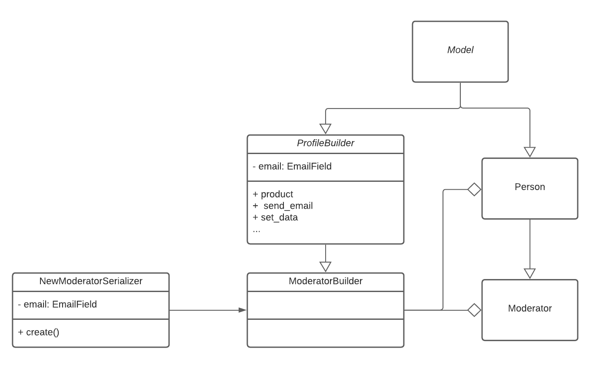

# Builder - Criação de uma conta de moderador

## Problema

<p style="text-indent: 20px; text-align: justify">
Como criar uma nova conta de moderador contendo os seus dados? Como permitir que a pessoa que será dona da conta de moderador cadastre sua conta?
</p>

## Solução

<p style="text-indent: 20px; text-align: justify">
Uma solução seria, um superusuário criar a conta de moderador manualmente, inserindo os dados pessoais, o que não é seguro e tampouco proveitoso. 
</p>

Então foi proposta a seguinte abordagem:

- Instanciar e salvar uma model do tipo ModeratorBuilder;
- Fornecer o email para esta model;
- Enviar um email com o link para a página de criação de conta para o moderador;
- O moderador preenche o formulário;
- Uma requisição é enviada para a API, construindo as partes restantes do Moderator;
- A model ModeratorBuilder retorna uma nova instância de moderador;
- A instância enfim pode ser salva, concluindo a criação;

<p style="text-indent: 20px; text-align: justify">
Ou seja, baseado numa abordagem de builder. Será preciso criar uma Model ModeratorBuilder que além de ser um builder se comporta também como um Moderador em processo de construção. Será demandado também uma View, para ser o endpoint para as requests de Moderador.  
</p>

<p style="text-indent: 20px; text-align: justify">
Abordagens semelhantes podem ser tomadas para problemas de criação de contas com papéis/perfis de responsabilidades diferentes.
</p>

## Modelagem



<a href="https://drive.google.com/file/d/16nmouwfYAg6tl0JegQ4VkxEqzZ6b7rrd/view?usp=sharing" target="_blank" rel="noopener noreferrer">Link para a imagem</a>

## Código

```python
class ProfileBuilder(models.Models):
    # A chave primária desta model será automática
    email = EmailField(unique=True)

    class Meta:
        abstract = True

    @abstract_property
    def product(self) -> None:
        pass

    @abstract_method
    def send_email(self) -> None:
        pass

    @abstract_method
    def set_data(self, data) -> None:
        pass


class Moderator(models.Models):
    """
        Todas as regras de domínio referentes aos dados da model de Moderador
    """
    pass


class ModeratorBuilder(ProfileBuilder):

    def product(self) -> Moderator:
        """
            Propriedade que retorna o produto final, no caso a instância de Moderator, prontap para ser salva
        """
        pass

    def send_email(self) -> None:
        """
            Método que tem a responsabilidade de enviar o email para o moderador contendo o link para o formulário de cadastro, seja por chamar um serviço de email
        """
        pass

    def set_data(self, data) -> None:
        """
            Método que é responsável por criar um novo objeto de Person com os dados fornecidos e também criar o objeto moderador
        """
        pass

```

## Versionamento

| Versão | Data       | Modificação                                  | Motivo                                         | Autor                |
| ------ | ---------- | -------------------------------------------- | ---------------------------------------------- | -------------------- |
| 1.0    | 04/04/2021 | Criação do documento                         | -                                              | Todos os integrantes |
| 1.1    | 08/04/2021 | Alteração da solução e inclusão da modelagem | Para que esteja documentado a modelagem do GOF | Marcelo Victor       |
