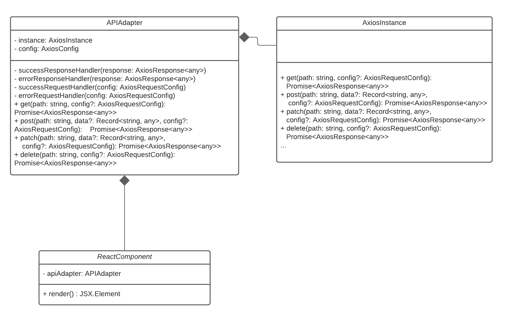

# API Adapter

## Problema

<p style="text-indent: 20px; text-align: justify">
Como fazer os componentes do Front-end interagirem com a API? Mantendo uma alta coesão e baixo acoplamento
</p>

## Solução

<p style="text-indent: 20px; text-align: justify">
Criar uma classe que funciona como um adaptador para a comunicação com a API, essa classe cria uma instância do Axios (biblioteca Javascript para requisições HTTP) e possui métodos públicos para cada verbo HTTP utilizado na aplicação. Esses métodos utilizam a instância do Axios e retorna uma promise para os componentes do Front-end que realizam as requisições para a API e eles podem tratar os casos de sucesso e erro como for conveniente. Nessa classe é possível também configurar <em>handlers</em> para erros comuns, como por exemplo, 401 (Unauthorized) que significa que a autenticação falhou e o usuário precisa realizar login novamente.
</p>

<p style="text-indent: 20px; text-align: justify">
Essa classe fornece para os componentes do Front-end apenas possui os métodos para os verbos HTTP, para que os componentes sejam adaptados para utilizar as funcionalidades fornecidas, temos então o padrão Adapter aplicado, dependente da composição de um objeto da classe API Adapter com as instâncias dos componentes do Front-end.
</p>

## Modelagem



<a href="https://drive.google.com/file/d/1anC75EUmuJwtzPYnY5XQg47NdQkIkkk5/view?usp=sharing" target="_blank" rel="noopener noreferrer">Link para a imagem</a>

## Código

### API Adapter

OBS: os métodos <em>interceptors</em>(request and response) não estão representados no momento, pois nesse ponto do projeto ainda não os implementamos.

```typescript
import axios, { AxiosInstance, AxiosRequestConfig } from "axios";

const CONFIG: AxiosRequestConfig = {
  timeout: parseInt(process.env.REACT_APP_GXCHANGE_TIMEOUT || "5000", 10),
  baseURL: `${process.env.REACT_APP_GXCHANGE_API_URL}/app/`,
  headers: {
    Accept: "application/json",
  },
};

export default class APIAdapter {
  private instance: AxiosInstance;

  constructor() {
    this.instance = axios.create(CONFIG);
  }

  async get(path: string, config?: AxiosRequestConfig) {
    const res = await this.instance.get(path, config);

    return res.data.results || res;
  }

  async post(
    path: string,
    data?: Record<string, any>,
    config?: AxiosRequestConfig
  ) {
    const res = await this.instance.post(path, data, config);

    return res.data.results || res;
  }

  async patch(
    path: string,
    data?: Record<string, any>,
    config?: AxiosRequestConfig
  ) {
    const res = await this.instance.patch(path, data, config);

    return res.data.results || res;
  }

  async delete(path: string, config?: AxiosRequestConfig) {
    const res = await this.instance.delete(path, config);

    return res.data.results || res;
  }
}
```

### Componente

```typescript
const send = async () => {
  try {
    const API = new APIAdapter();

    validateFields();

    setLoading(true);

    const params = {
      email,
      name,
      nickname,
      phone,
      password,
    };

    await API.post("/user", params);

    dispatch(
      openModal({
        title: "Sucesso",
        type: "success",
        content: "Conta criada com sucesso",
      })
    );

    history.push("/");
  } catch (error) {
    dispatch(
      openModal({
        title: "Erro",
        type: "error",
        content: error.message,
      })
    );
  } finally {
    setLoading(false);
  }
};
```

## Versionamento

| Versão | Data       | Modificação                    | Motivo                                                           | Autor                |
| ------ | ---------- | ------------------------------ | ---------------------------------------------------------------- | -------------------- |
| 1.0    | 04/04/2021 | Criação do documento           | Documentar a necessidade do API Adapter                          | Todos os integrantes |
| 1.1    | 05/04/2021 | Correção no texto da "solução" | Melhorar a documentação do padrão Adapter no contexto do projeto | Todos os integrantes |
| 1.2    | 05/04/2021 | Inserção da modelagem          | Melhorar a compreensão do GOF em questão                         | Marcelo Victor       |
