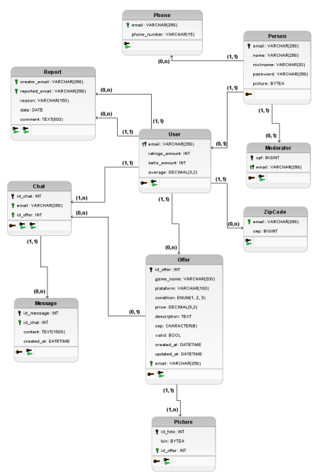

# Modelagem do Banco de Dados

## Introdução

Para compreender e definir as entidades e relacionamentos no contexto do sistema decidimos criar um Diagrama Entidade Relacionamento (DER). Após ter desenvolvido o diagrama conceitual, partimos para o nível lógico e criamos um Diagrama Lógico de Dados (DLD), representando todas as tabelas, atributos e tipos de dados que serão utilizados na implementação do banco de dados.

## Diagrama Entidade Relacionamento (DER)

<a href="https://drive.google.com/file/d/1cqCah7bLu-0qh3CzmRk2GIT-sJmzihvc/view?usp=sharing" target="_blank" rel="noopener noreferrer">Link para a imagem</a>

## Diagrama Lógico de Dados (DLD)

<a href="https://drive.google.com/file/d/1HP4963lRFhK4rGTnb4mg1Lq1OenbfkpQ/view?usp=sharing" target="_blank" rel="noopener noreferrer">Link para a imagem</a>

## Referências

> TEOREY, Toby; LIGHTSTONE, Sam; NADEAU, Tom; JAGADISH, H.V. "Database Modeling and Design". Elsevier Inc, 2011.

> brModelo 3.3. SIS4. Disponível em: http://www.sis4.com/brModelo/. Acesso em: 28. março 2021.

## Versionamento

| Versão | Data       | Modificação          | Motivo                                                 | Autor                |
| ------ | ---------- | -------------------- | ------------------------------------------------------ | -------------------- |
| 1.0    | 28/03/2021 | Criação do documento | Compreender e documentar a estrutura do banco de dados | Todos os integrantes |
