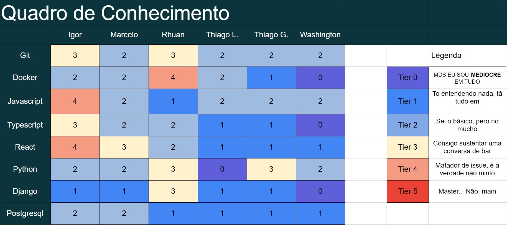

# Revisão da Sprint 1

## Quadro de conhecimentos

<a href="https://drive.google.com/file/d/1uydCa6GdV0EkR9Cfc88E3BOEN69kM0zj/view?usp=sharing" target="_blank" rel="noopener noreferrer">Link para a imagem</a>

## O que ficou pronto nessa sprint? (PO)

Fora a US04 (Termo de consentimento), todas as User Stories propostas para essa sprint foram completas. Visto que aspectos relacionados à documentação do projeto também eram necessários, não houve um grande déficit. 

## Aspectos da sprint

### Aspectos positivos

- Finalizamos o cadastro por email
- Foi possível ter uma ideia do funcionamento do front-end e back-end
- Docker funcionando bem do agora
- Experiência com Cross origin
- Banco de dados funcionando bem
- Fizemos os documentos de GRASPs e GOFs

### Problemas / soluções

- Os documentos GRASPs e GOFs tomaram bastante tempo - Dormi menos do que o normal
- Docker do front deu sinais que estava quebrado.
  - A pasta node_modules não estava dentro de um volume anônimo, o que isso quer dizer? Não sabemos (DevOps aprendeu o que era, mexe com isso a semana toda). Só o futuro nos dirá e o DevOps tentou.
- Super Lint vinha nos decepcionando bastante
  - O substituimos por uma action fe autoria própria
- Problemas com o Docker funcionar feito uma porta no WSL, mas as vezes dá certo.
  - wsl.exe --shutdown
- Problemas com váriaveis de ambiente (erros de configuração)
  - Configuramos corretamente utilizando o react-dotenv

## O produto irá ser finalizado no prazo? (PO)

Por ser a primeira sprint, não há como julgar se finalizaremos o projeto no prazo desejado, visto que foi um período de ambientação com as tecnologias.

## O que vem a seguir?

- Finalizar todas as issues com a prioridade muito alta
- Finalizar o termo de consentimento
- Trabalho realizado em duplas, vulgo pareamento

## Mudanças no backlog de produto

- A issue do termo de consetimento (US04) irá ser passado para a próxima sprint
- As issues de cadastro com Google (US01) e Facebook (US02) serão alteradas para prioridade baixa

## Referências

> SCHWABER, Ken; SUTHERLAND, Jeff. “Guia do Scrum - Um guia definitivo para o Scrum: As regras do jogo”. Scrum.Org and ScrumInc, 2014.
